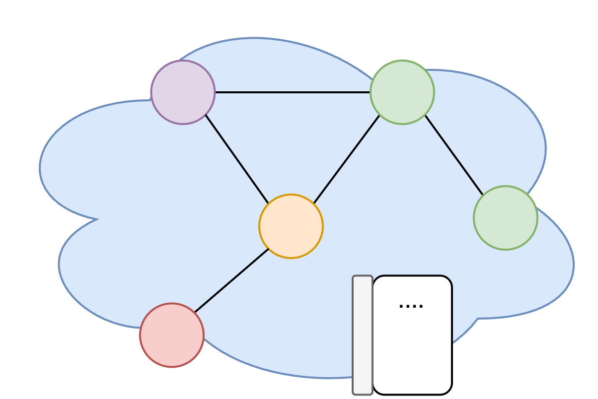
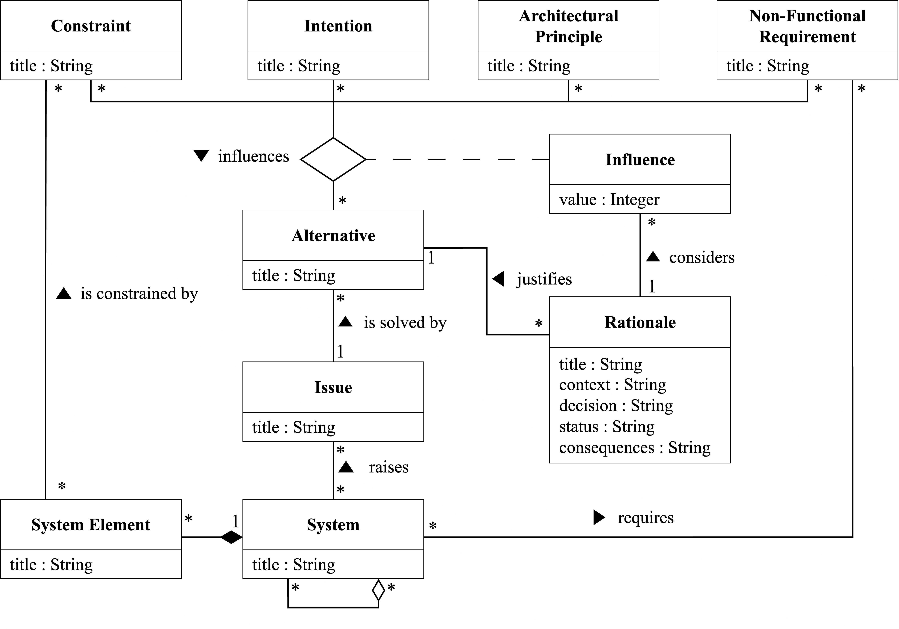
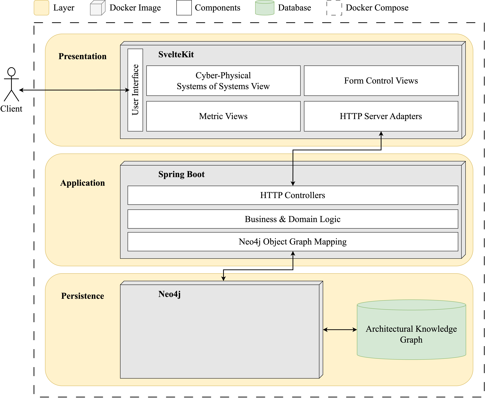

<!-- Improved compatibility of back to top link: See: https://github.com/othneildrew/Best-README-Template/pull/73 -->
<a id="readme-top"></a>
<!--
*** Thanks for checking out the Best-README-Template. If you have a suggestion
*** that would make this better, please fork the repo and create a pull request
*** or simply open an issue with the tag "enhancement".
*** Don't forget to give the project a star!
*** Thanks again! Now go create something AMAZING! :D
-->

<!-- PROJECT LOGO -->
<br />
<div align="center">
  <a href="">
    
  </a>

  <h3 align="center">Formal Model of Architecture Decision Records for Cyber-Physical Systems of Systems</h3>

  <p align="center">

  </p>
</div>

<!-- TABLE OF CONTENTS -->
<details>
  <summary>Table of Contents</summary>
  <ol>
    <li><a href="#about-the-project">About The Project</a></li>
    <li><a href="#usage">Usage</a></li>
    <li><a href="#getting-started">Getting Started</a></li>
    <li><a href="#overview-of-the-project">Overview of the Project</a></li>
    <li><a href="#license">License</a></li>
  </ol>
</details>

<!-- ABOUT THE PROJECT -->
## About The Project

### Architecture Decision Record Model



### Architecture Decision Record Warehouse



<p align="right">(<a href="#readme-top">back to top</a>)</p>

<!-- USAGE EXAMPLES -->
## Usage

* Model-Based Architecture Decision Recording
* Architectural Knowledge Graph

<p align="right">(<a href="#readme-top">back to top</a>)</p>

<!-- GETTING STARTED -->
## Getting Started

To get a local copy up and running follow these simple example steps.

### Installation

1. Clone the repo

   ```sh
   git clone https://github.com/nikokelx/Architecture-Decision-Record-Warehouse
   ```

2. Start docker compose

   ```sh
    docker compose -f source/docker/docker-compose.dev.yml up --build -d
   ```

<p align="right">(<a href="#readme-top">back to top</a>)</p>

<!-- Overview of the project -->
## Overview of the Project

* Open <http://localhost:3000> to access the user interface of Architecture Decision Record Warehouse.
* Open <http://localhost:7474> to access the user interface of neo4j. The username is neo4j, and the passwort secret123

<p align="right">(<a href="#readme-top">back to top</a>)</p>

<!-- LICENSE -->
## License

Distributed under the MIT License. See `LICENSE.txt` for more information.

<p align="right">(<a href="#readme-top">back to top</a>)</p>
